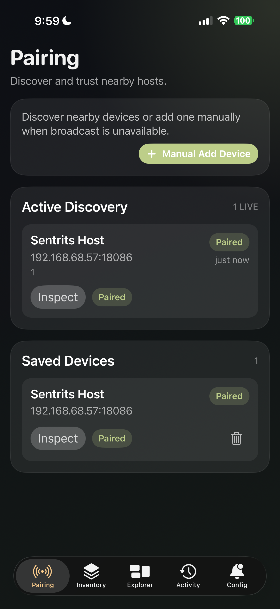
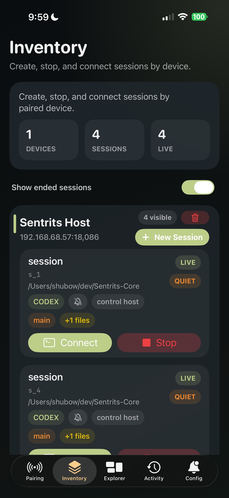
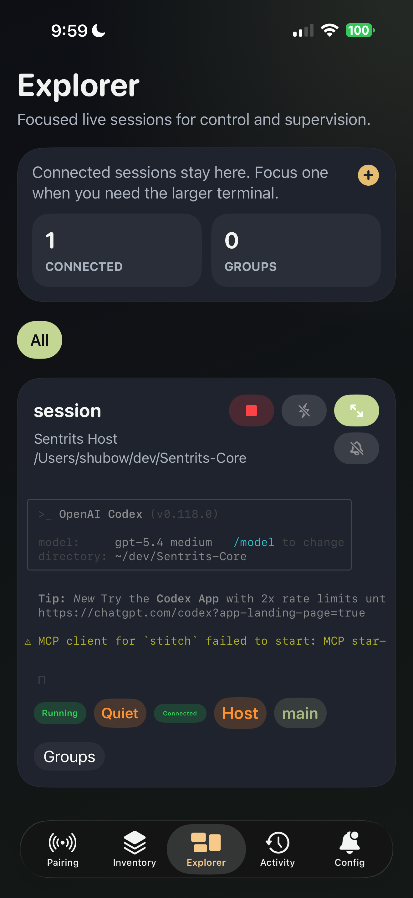
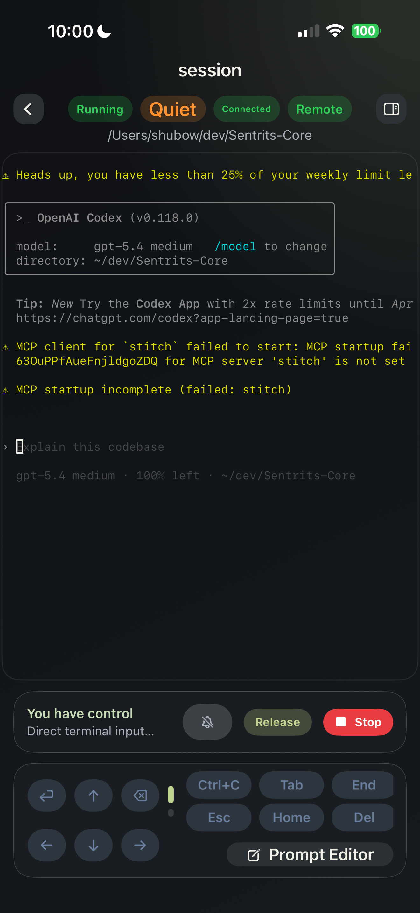
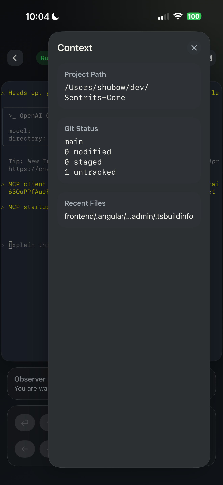
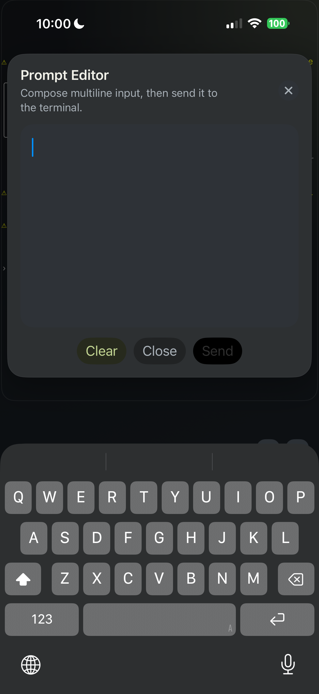

  

# Sentrits iOS

Native iOS client for [Sentrits-Core](https://github.com/shubow-sentrits/Sentrits-Core).

Sentrits iOS is a session-centric remote companion for AI coding and terminal workflows. It discovers and pairs with Sentrits hosts on the local network, organizes sessions by device, keeps a connected Explorer workspace, and opens a focused terminal control surface optimized for mobile supervision and intervention.

## What It Is

- native iOS client for Sentrits hosts
- SwiftTerm-first terminal experience with xterm.js fallback
- device-grouped session inventory
- connected-session Explorer workspace
- focused control view for live terminal interaction
- local activity log and local notification support

## Screenshots

  
  
  

  
  
  

## Current Features

### Pairing And Host Management

- UDP discovery of nearby hosts
- manual host add and verification
- pairing request and claim flow
- saved host persistence
- host identity-aware dedupe

### Inventory

- sessions grouped by device
- create new sessions per host
- stop sessions
- clear inactive sessions
- show or hide ended sessions
- toggle per-session notifications

### Explorer

- connected-session workspace
- group tabs backed by session group tags
- compact live terminal previews
- connect, disconnect, stop, and focus actions
- bulk notification toggles by group

### Focused Session

- full-screen focused terminal
- request and release control
- direct keyboard input
- resize handling
- prompt editor
- directional and control-key input bar
- keyboard-aware overlay controls
- session context side panel

### Terminal Rendering

- SwiftTerm is the default renderer
- xterm.js remains available as a manual fallback in Config
- renderer switching is user-selectable at runtime

### Notifications And Activity

- local notification permission flow
- quiet notification toggle
- stopped notification toggle
- quiet threshold selection
- local activity timeline with severity and category grouping

## Architecture And Docs

- [iOS client architecture](docs/IOS_CLIENT_ARCHITECTURE.md)
- [iOS features](docs/IOS_FEATURES.md)
- [iOS terminal integration](docs/IOS_TERMINAL_INTEGRATION.md)
- [iOS debugging and tracing](docs/IOS_DEBUGGING_AND_TRACING.md)
- [iOS troubleshooting](docs/IOS_TROUBLESHOOTING.md)
- [iOS test checklist](docs/IOS_TEST_CHECKLIST.md)
- [MVP notes](MVP_NOTES.md)

## Current State

The app is already usable as a real first-class client:

- focused terminal control works
- SwiftTerm materially improves terminal quality on iOS
- Inventory and Explorer flows are in place
- pairing, saved hosts, and local notification preferences are implemented

Current rough edges:

- focused terminal scroll behavior still needs tuning
- heavy live output can still expose renderer polish gaps
- xterm.js is still kept around as a fallback path
- notifications are local-device notifications, not APNs push

## MVP For The Next Release

The next release should focus on tightening the focused terminal experience rather than broadening product scope.

Priority areas:

1. improve SwiftTerm scroll and cursor-follow behavior in focused view
2. harden focused control handoff and redraw behavior under heavy live output
3. keep xterm.js fallback healthy while SwiftTerm matures
4. continue tightening session-history and viewport consistency
5. expand smoke coverage and regression testing for terminal flows

## Source Of Truth

If docs and code disagree, trust the app entry and shell:

- [SentritsIOSApp.swift](SentritsIOS/App/SentritsIOSApp.swift)
- [AppShellView.swift](SentritsIOS/App/AppShellView.swift)

The terminal boundary lives in:

- [TerminalTextView.swift](SentritsIOS/Views/TerminalTextView.swift)
- [SentritsSwiftTermView.swift](SentritsIOS/Views/SentritsSwiftTermView.swift)

The host/runtime backing this client lives in:

- [Sentrits-Core](https://github.com/shubow-sentrits/Sentrits-Core)
